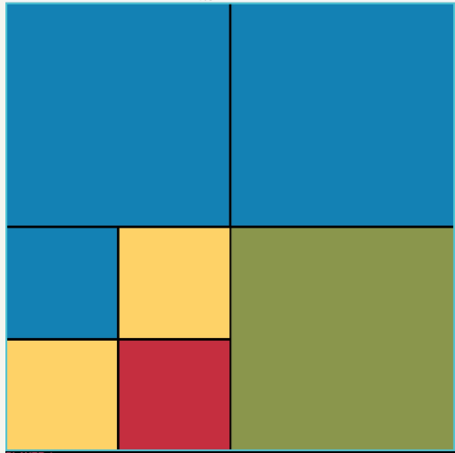
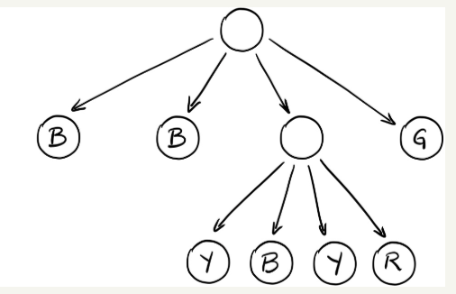

# CS2920-GridGame

View the Grid Game tutorial youtube: 
https://youtu.be/ZX7LHiecF1k 

Note also there is an accompanying jar file included in the directory. 

You may run the jar file from the command line as:

java -jar A2-Grid.jar

In this assignment you will code the back-end for the grid game. You are given starter code in an intelliJ project in the A2-Grid directory. The GUI for the game is provided for you.

The backend should be implemented as a QuadTree - that is a tree in which each node has 0 or 4 children. The children will each have a color and a level within the tree this will correspond to a location on the screen. 

Example:

           __  Root  __
         /    |    |   \ 
        ur    ul   ll   lr
                / |  | \
              ur  ul ll lr
              
At the base level of the game is the root (level 1) this occupies the whole screen. As you can see the root has 4 children: upper right, upper left, lower left and lower right. These are all at level 2, but then we also notice the lower left child of the root also has 4 children. The lower left has an upper right, and upper left a lower left and a lower right. 

See below the above example with colors:

Flattened Tree:

Quad Tree drawing of the same tree:

In the game you'll have to keep track of the current cursor position (a yellow highlight around the block representing the current cursor position). You are provided a helper class called Rectangle which gives all the required attributes you must keep track of for a square in the game board to be rendered by the GUI. You'll need to provide the x,y position, the size, whether the square is visible, whether it is selected and for score keeping purposes how much of the square is touching the edge of the screen, along with the square's color. 

All of your code should go into the NestedGrid class - you'll implement all of the public methods. You may add other classes if you wish. But should not alter the other classes - unless you'd like to adjust the color scheme or add unit-tests, etc.

The following basic functionality should be implemented:

moves - up down, clockwise, counter-clockwise. Each of the moves should move the selected square in the appropriate direction. ll of the moves are relative to the currently selected square, eg, move ccw should move the selected square to be the nearest sibling in the ccw direction. Down should move the selected square to now be the upper right child of the previously selected square. A

smash - smash a block by augmenting it with 4 randomly colored children

rotate - rotate the children of the currently selected block either clockwise or counterclockwise

flip - flip (mirror) the children of the currently selected block either vertically or horizontally

In addition you should implement a method: rectanglesToDraw which should return an array of Rectangles to be drawn on the screen including their position, color, whether they are the selected square and how much border of the screen they occupy. 

Deliverables:

You may work with a partner on this assignment.

Check in your name and partner's name into Github before Monday Feb 3, 2020 11:59pm into a file called Plan.pdf including one sentence outlining what parts of the assignment each person will complete. 

Check your solution into Github before Friday Feb 7, 2020 11:59pm. 

Your solution should contain all the functionality outlined in the game and match the sample game. Your code should be well designed and readable.

Grades: 

1 pts: Plan.pdf checked in by Feb 3, 2020 11:59pm

1 pts: Code readability - appropriate variable names, and spacing 

3 pts: Code design - class structure, methods, efficiency, and design choices 

5 pts: Code functionality - does the game play correctly without error, do unit tests (including those not included in the starter code) pass?

